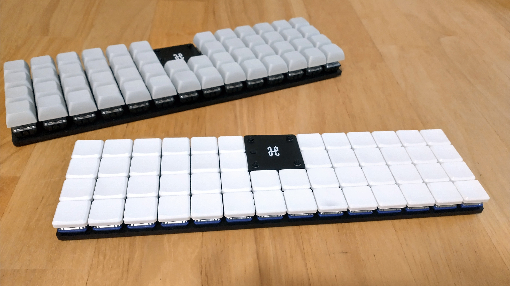
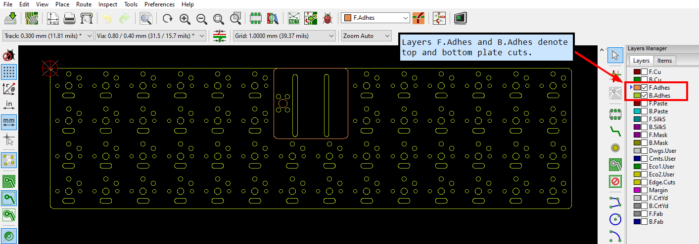

# Horizon Keyboard

Horizon is a 52 key (4x14) ortholinear keyboard, powered by an Arduino Pro Micro.

This keyboard is a grid of 1U keys with no special features: no hotswap, no RGB, no OLED screen, no knobs.

## Project structure

* [`gerbers`](gerbers): Gerber files for PCB manufacturing
* [`graphics`](graphics): Source assets for PCB silkscreen
* [`kicad`](kicad): KiCad project files (schematics and PCB designs)
* [`kicad-libraries`](kicad-libraries): KiCad components and footprints
* [`kicad-plugins`](kicad-plugins): KiCad Pcbnew Python plugins
* [`images`](images): Images for project documentation

## PCBs

Two separate PCB designs are available for MX and Choc keyswitches, with their respective footprints and key spacing (MX: 19mm x 19mm, Choc: 18mm x 17mm).

Each design consists of a main PCB, a top plate to protect the microcontroller, and a bottom plate to protect the bottom components:

The bottom plate is a cutout of all the components exposed through the bottom of the main PCB, and screws *directly* against the main PCB. This nicely guards you and your desk surface from all the pointy through-hole bits, while retaining a low keyboard height:

## KiCad project notes

The bottom and top plates are generated via a custom KiCad 5 plugin [Horizon Board Producer](kicad-plugins/horizon-board-producer-plugin.py).

For the plugin to generate these plate boards, the PCB and its footprints use the following layer convention:
* Layer `F.Adhes` denotes edge cuts for the top plate.
* Layer `B.Adhes` denotes edge cuts for the bottom plate.

The Horizon Board Producer plugin also generates all the Gerber files for production.

**IMPORTANT:** If you would like to use this plugin and plate edge cuts convention for you own project, please make sure you carefully examine the output Gerber files! The plugin ultimately worked well for my case, but you might need to make adjustments to the plugin to suit your project.

## Keyboard firmware

* [QMK](https://github.com/qmk/qmk_firmware/tree/master/keyboards/horizon)
* ZMK: *Coming soon*

## Bill of materials

For PCBs, keyswitches, and keycaps, get parts depending on your desired keyswitch type.

Vendor URLs are just recommendations based on quality/affordablity. I have purchased from these vendors, but have no personal affiliation with them.

Part | Purpose | Quantity | Notes | Vendor URL
---- | ------- | -------- | --------- | ----------
Main PCB  | circuit board | 1 | | Send Gerber zip files to [JLCPCB](https://jlcpcb.com/).
Top plate PCB  | protects microcontroller | 1 | 
Bottom plate PCB  | protects bottom pins and components | 1 | **IMPORTANT: JLCPCB charged $15.20 USD extra due to the number of small holes**
Arduino Pro Micro | Microcontroller board | 1 | Or use another Pro Micro compatible board with same dimensions (confirmed Elite-C V4 and nice!nano 2.0 fit) | [AliExpress - Micro USB 3-18V](https://www.aliexpress.com/item/32849563958.html)
6x6mm DIP 4-pin tactile switch | Reset button | 1 | | [AliExpress - 6x6x10mm](https://www.aliexpress.com/item/32912263133.html)
1N4148 SOD-123 | Diodes for keyboard row-column matrix | 52 | | [AliExpress - 1N4148 SOD-123](https://www.aliexpress.com/item/4000331408283.html)
Keyswitches |  | 52 | PCB mount (5 pin) switches recommended | MX: [KBDFans - Gateron Switches (10 switches)](https://kbdfans.com/collections/gateron-swithes/products/gateron-swtich-3pin-or-5pin?variant=35765199629), Choc: [MKUltra Corporation - Kailh Low Profile Choc Switches](https://mkultra.click/choc-switches)
Keycaps |  | 52 | | MX: [AliExpress - DSA 104 Key](https://www.aliexpress.com/item/33047340638.html?spm=a2g0s.9042311.0.0.2fcc4c4dcDlC15), Choc: [MKUltra Corporation - MBK Choc Keycaps](https://mkultra.click/mbk-choc-keycaps)
M2 6mm screws | Secure main PCB and plate PCBs | 8 | | [AliExpress - 200PCS-M2 Mix - Black](https://www.aliexpress.com/item/32862529967.html)
M2 nuts | Secure main PCB and plate PCBs | 8 | | See M2 set above
M2 8mm male-female standoffs | Raise top plate PCB above microcontroller | 4 | | See M2 set above
2mm tall rubber bumpons | Raise board above desk surface and provide skid resitance | 6 | Shop around - you can get cheaper alternatives if you don't need 96 of them! | [Amazon - 3M SJ5302 Clear Bumpon Blister Pack (96 Bumpons)](https://www.amazon.com/SJ5302-Clear-Bumpon-Blister-Bumpons/dp/B01ACPT2LU)

I recommend using sockets for the Pro Micro. For socketing options, refer to [40% Keyboards' sockets article](https://www.40percent.club/2018/03/sockets.html).

M2 standoff height requirements are dependent on the seated microcontroller height. An M2 spacer set should give you enough options. I recommend getting a reset button ~2mm taller than the M2 standoffs so the button is level with the top plate.

If using a LiPo battery and a bluetooth Pro Micro compatible board, then use battery size 301230. Just make sure the microcontroller socket height provides clearance for the battery to fit underneath (standard SIP sockets are a common choice).

## PCB manufacturing settings

These are the manufacturing settings I used when ordering from JLCPCB:

* **Base Material**: FR4
* **Layers**: 2
* **Dimensions**: (whatever the gerber file specifies)
* **PCB Qty**: 5
* **Different Design**: 1
* **Delivery Format**: Single PCB
* **PCB Thickness**: 1.6
* **PCB Color**: Black
* **Silkscreen**: White
* **Surface Finish**: LeadFree HASL-RoHS
* **Outer Copper Weight**: 1 oz
* **Gold Fingers**: No
* **Confirm Production File**: No
* **Flying Probe Test**: Fully Test
* **Castellated Holes**: No
* **Remove Order Number**: Specify a location

**IMPORTANT:** All PCBs have ["JLCJLCJLCJLC" silkscreen text](https://support.jlcpcb.com/article/28-how-to-remove-order-number-from-your-pcb) underneath the Pro Micro footprint. If you want to remove the order number from the boards or you want to print the PCBs with another manufacturer, then I recommend removing this silkscreen text from the `.kicad_pcb` file, and then re-run the Horizon Board Producer plugin to create the updated Gerber files.

**IMPORTANT:** When uploading the top and bottom plate files to JLCPCB, their preview software does not render the interior cutout holes. This is a limitation of their preview, not an issue with the Gerber files. The boards printed correctly in my experience!

## Build tips

* The main PCB uses a ground plane, so ground pads are more stubborn to solder. Make sure your soldering tip has good surface area coverage across the pad and component leg. If your soldering iron supports it, turning up the temperature a bit can help too.
* Before soldering the keyswitches, make sure they are perfectly straight and fully inserted into the PCB. Put the keycaps on the inserted keyswitches, and give a thorough visual inspection for any spacing or height irregularities between the keycaps. For MX builds, Gateron switches in particular have thicker PCB-mount pins - push these keyswitches in hard to make sure they are fully inserted!
* To get a perfect fit between the main PCB and bottom plate, keep your soldering tidy! Clean any excess solder/flux which falls outside the bounds of the bottom plate cutouts.
* Attaching the main PCB and the bottom plate requires a very steady hand. The approach that worked best for me was using narrow tweezers to grip the edges of the hex nut against the main PCB, while driving in the screw from the bottom plate.
* The top plate is a very tight fit. If the inner keycaps rub against it, first ensure the top plate is perfectly centered. To center it, slide a thin piece of cardstock in-and-out between the inner keycaps and the top plate on all sides. If that does not resolve the keycaps rubbing, then remove the top plate, sand its edges a bit, and try again.

## Revision history

* Rev1 (2021-07-30 - not publicly released):
    * PCB: Experimental prototype of MX board.
    * Schematic: Wire as 42 key 7x6 matrix (original release only had 6 keys on bottom row).
* Rev2 (2021-9-26)
    * PCB: Create MX and Choc boards with bottom and top plates.
    * Schematic: Wire as 52 key 4x14 matrix.
* Rev2.1 (2021-10-24)
    * PCB: Slightly improve thermal relief clearance to make soldering ground pads easier.